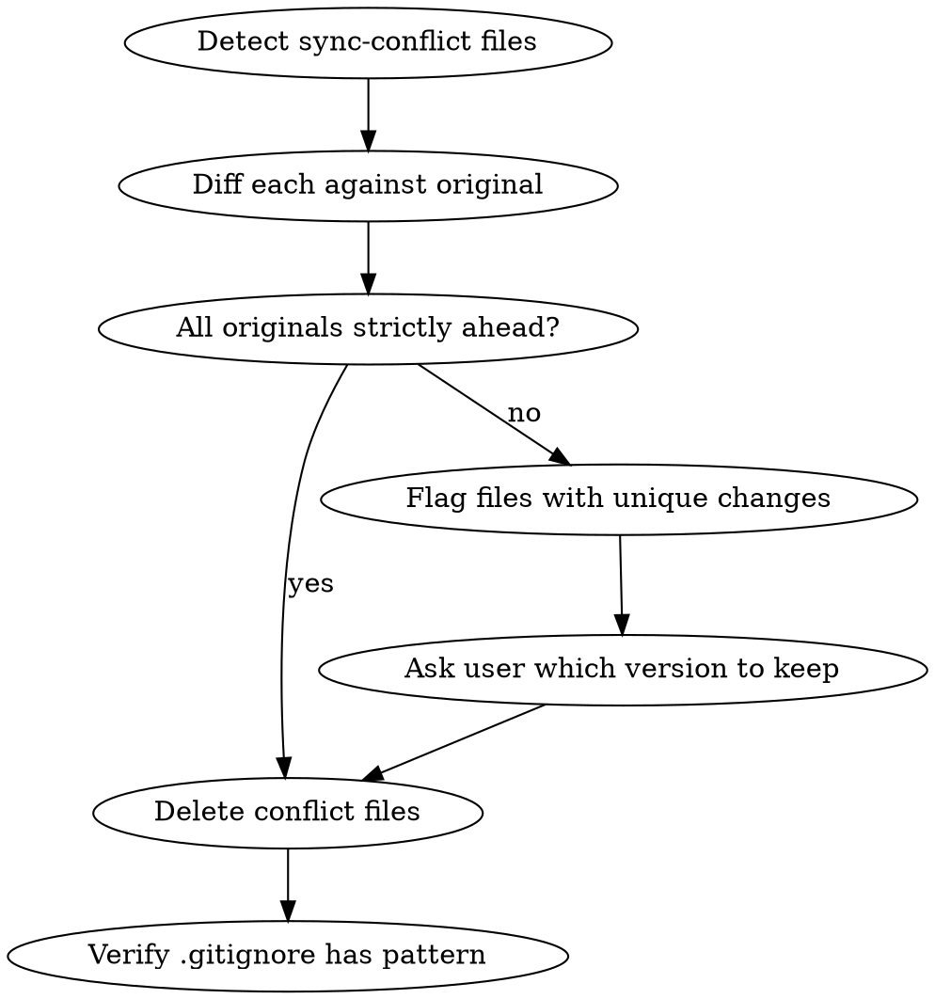

# Clean Sync Conflicts

## Overview

Syncthing creates `.sync-conflict-*` files when the same file is modified on two devices before sync completes. These files are stale snapshots that clutter the repo. This skill ensures they're safely reviewed and removed.

## When to Use

- `git status` shows untracked `*.sync-conflict-*` files
- User mentions sync conflicts or Syncthing issues
- Session startup hook reports sync conflict files

## Process



### 1. Detect

```bash
# Find all sync conflict files in the repo
git status --short | grep 'sync-conflict'
# Or broader search:
find . -name '*.sync-conflict-*' -not -path './node_modules/*'
```

### 2. Diff Each Against Original

For each conflict file, derive the original path by removing the `.sync-conflict-YYYYMMDD-HHMMSS-DEVICEID` segment:

```
# Conflict: apps/cli/src/commands/dock.sync-conflict-20260316-182147-6PCZ3ZU.ts
# Original: apps/cli/src/commands/dock.ts
```

Run `diff` between each pair. Report whether:
- **Original is ahead** (conflict is stale) — safe to delete
- **Conflict has unique changes** (original may be missing work) — flag for user

### 3. Clean Up

- Delete all conflict files confirmed as stale
- If any conflict files have unique changes, show the diff and ask the user which version to keep before deleting

### 4. Verify .gitignore

Ensure the repo's `.gitignore` contains:

```
*.sync-conflict-*
```

If missing, add it under the OS section.

## Quick Reference

| Sync Tool | Conflict Pattern | Cause |
|-----------|-----------------|-------|
| Syncthing | `*.sync-conflict-YYYYMMDD-HHMMSS-DEVICEID.*` | Same file edited on 2+ devices before sync |
| Nextcloud | `* (conflicted copy YYYY-MM-DD).*` | Same file edited on 2+ devices |
| Dropbox | `* (USER's conflicted copy).*` | Same file edited on 2+ devices |

## Common Mistakes

- **Deleting without diffing** — Conflict files occasionally contain work that hasn't made it to the original. Always diff first.
- **Missing the .gitignore entry** — Without it, conflict files will keep showing up in `git status` on every conversation.
- **Forgetting nested paths** — Sync conflicts can appear anywhere in the tree, not just top-level. Use recursive search.
